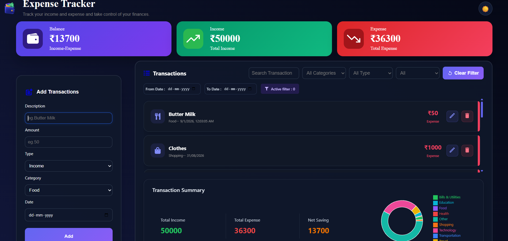

# 💰 Expense Tracker Dashboard

A responsive and modern expense tracking dashboard built with React.js to manage income and expenses, analyze spending patterns, and keep track of personal finances.

## 🚀 Live Demo

[View Live Demo](https://yash-expensetracker.netlify.app/)

## ✨ Features

- Add income and expense transactions
- Edit and delete transactions
- Search transactions
- Filter by category
- Filter by transaction type
- Filter transactions by date range
- Sort transactions by newest, oldest, highest amount, and lowest amount
- Automatic income, expense, and balance calculation
- Category-based expense visualization using a pie chart
- LocalStorage support for persistent data
- Empty state when no transactions are available
- Responsive design for desktop, tablet, and mobile devices

## 🛠️ Tech Stack

- React.js
- JavaScript
- CSS
- React Hook Form
- Recharts
- React Icons
- LocalStorage
- Vite

## 📂 Project Structure

```text
src/
├── assets/
├── component/
│   ├── Dashboard Summary.jsx
│   ├── PiechartComponent.jsx
│   ├── TransactionFilter.jsx
│   ├── TransactionList.jsx
│   ├── Transactions.jsx
│   └── TransactionsForm.jsx
├── App.jsx
├── App.css
└── index.css
```

## 💾 Data Persistence

Transactions are stored in the browser's LocalStorage, allowing users to retain their transaction data even after refreshing the page.

## 📱 Responsive Design

The application is designed to work across:

- Desktop
- Tablet
- Mobile

## 📸 Screenshots

### Expense Tracker Dashboard



## ⚙️ Installation

Clone the repository:

```bash
git clone https://github.com/Yash-bot-max/expense-tracker-dashboard.git
```

Navigate to the project directory:

```bash
cd expense-tracker-dashboard
```

Install dependencies:

```bash
npm install
```

Start the development server:

```bash
npm run dev
```